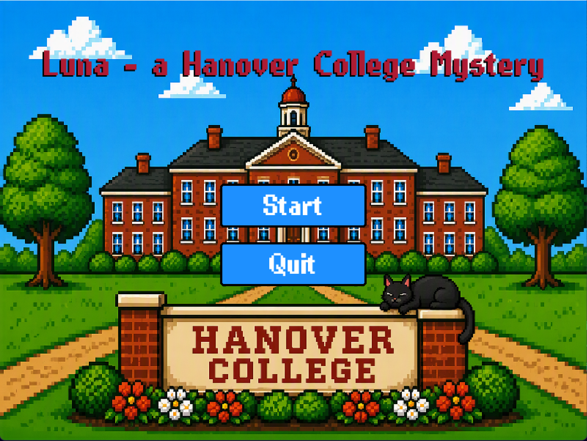
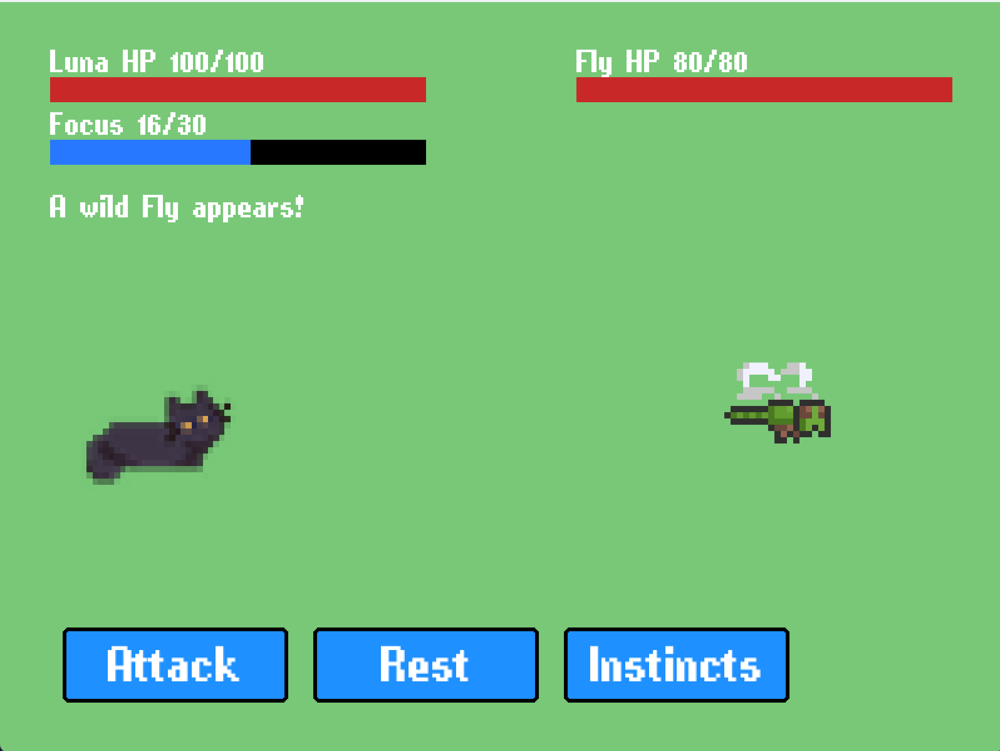

# Luna: A Turn-Based Cat RPG 



**A cat searching Hanover's campus for her missing human.**

Every mechanic serves one tension — *"act, or refuel?"* — in a setting everyone in this room recognizes.


---

## The Story

- Luna's human has gone missing somewhere on campus
- Each run, the human's location is seeded randomly in a building
- Search the campus, fight escalating battles, and find her before Luna is defeated

---

## Core Gameplay

- Menu combat: Attack, Items, Defend, Instincts, Steal
- Agility drives both turn order and dodge
- "Act, or refuel?" — spend Focus on strong actions, or Rest (skip your turn) to recharge
- Status effects (Riled, Soaked, Puffed) with explicit stacking rules


---



---

## Architecture

```
game/main.py     UI, input, drawing (pygame only)
     │ calls
     ▼
game/battle.py   pure battle logic (state machine, no pygame)
     │ uses
     ▼
game/config.py   constants · game/ui.py  widgets · game/sprites.py  art
```

Battle logic is a pure state machine — testable without opening a window.

---

## Why Python + Pygame, Not Godot

- A turn-based game *is* a state machine — menus and click handling are Pygame's comfort zone
- Python is already familiar — no multi-week stack-learning phase
- Runs with a single command: `python game/main.py`
- Godot was considered: its scene/UI tools would help, but the learning curve and the switch away from Python outweigh that for this scope

---

## Related Work

| Game | What Luna takes | What Luna changes |
|---|---|---|
| Slay the Spire | Run structure, seeded runs, bosses | Menu combat instead of deck-building; real campus, not abstract floors |
| Pokémon | Menu combat, turn order, statuses | Per-run progression; adds the Focus/Rest economy |
| Cat Quest | Cat protagonist, RPG systems | Turn-based roguelike, not action RPG |
| Stray | Cat-with-a-mission premise | Adds combat and replayable runs |

---

## Demo

1. Launch the game: `python game/main.py`
2. Fight a battle — spend Focus vs. Rest, watch Agility swing turn order


---

## Questions?